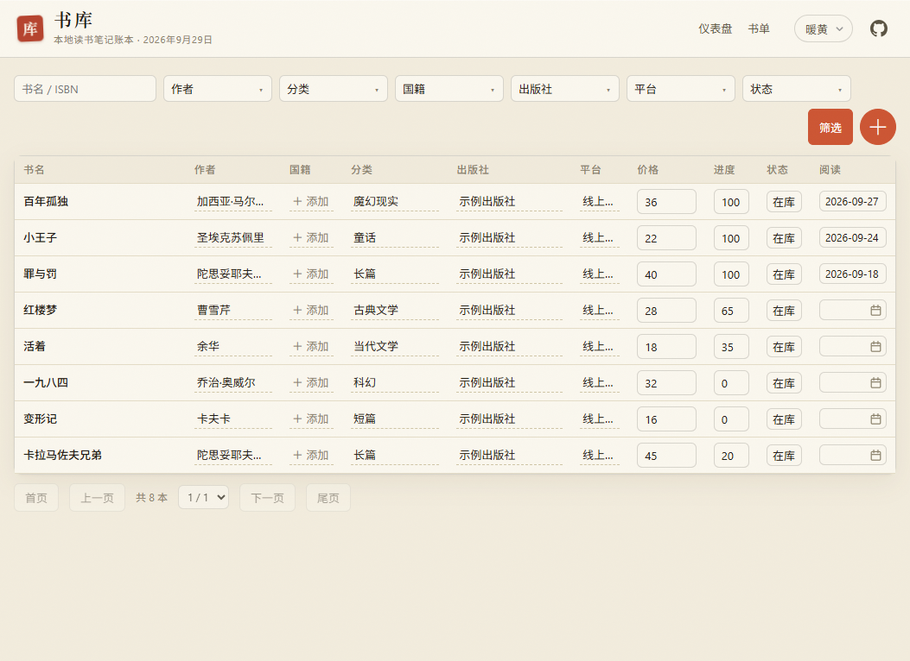
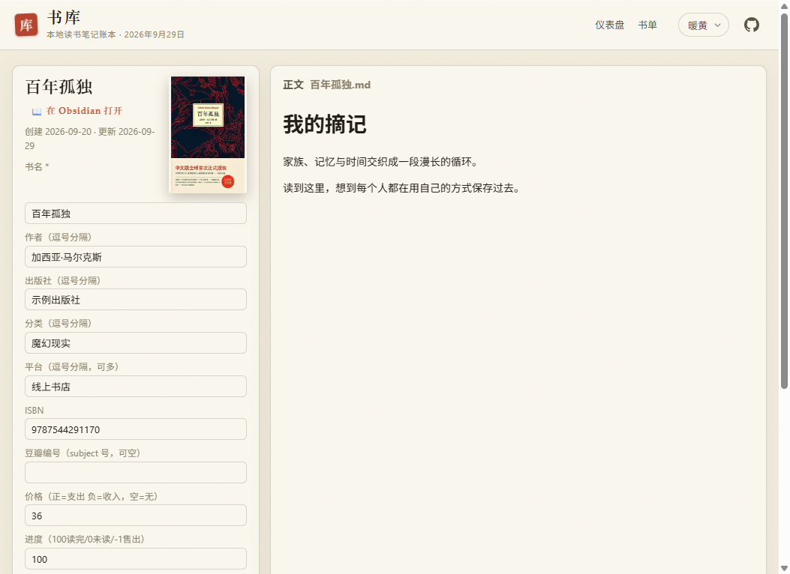

# book log 📚

一个给自己用的读书记录小工具：记书、记笔记，也记下买书花了多少钱。

我之前用 notion 记录我的读书笔记以及花费，不过每次都要魔法就很难受，后面想找一款类似的工具，但试了一圈，总觉得差强人意，要么不符合我的使用习惯，要么有些功能还需要收费，万一哪天平台倒了，记录的数据也难免遭殃。求人不如求己，于是就用 **vibe coding** 给自己搭了这个本地书库：哪里用着不顺，就边用边改。

它不是想做成什么全能阅读社区，也没有打卡、排名和推荐算法。更像是一个安静的私人书架——书读到哪儿了、当时花了多少钱、读完留下了什么，都能慢慢收在一起。

> 项目还在边用边做，主要服务我自己的阅读习惯；如果你也喜欢这种简单、自己掌握数据的读书账本，欢迎试试看。

## 看看长什么样

以下截图来自独立的示例书库，书目、笔记和金额都是虚构数据。

<p align="center">
  
</p>
<p align="center">
  
</p>
<p align="center">
  
</p>

## 可以拿它做什么

- **收好自己的书**：按作者、分类、出版社、平台和在库状态整理书目，也能顺手记下价格、进度和评分。
- **看看阅读与买书习惯**：仪表盘把藏书封面、购书日历、阅读节奏和花费整理成几张图。
- **让笔记跟书待在一起**：正文用 Markdown 保存，可以继续用 Obsidian 写；回到书目详情时也能直接查看。
- **按自己的方式管理**：这是本地运行的个人工具，不用注册账号；书目和笔记都保存在自己的文件里。

## 开始使用

安装 [uv](https://docs.astral.sh/uv/)，在项目目录运行：

```bash
uv sync
uv run uvicorn app.main:build_app --factory --host 127.0.0.1 --port 8000
```

然后打开 <http://127.0.0.1:8000>。

在书单页登记书目；写读后感或摘抄时，把 Markdown 文件放进 `raw/books/`，就可以用 Obsidian 编辑，也能在书籍详情里阅读。

## 数据放在哪里

- 书名、作者、进度、评分和价格等信息保存在 `books.db`。
- 读后感和摘抄是 `raw/books/` 里的 Markdown 文件，方便自己备份、编辑和迁移。
- 封面保存在 `raw/covers/`。有 ISBN 时可在详情页点击「按 ISBN 找豆瓣编号」：确认豆瓣条目的 ISBN 一致后才保存编号。随后可单独点击「抓封面」；手填豆瓣编号也能直接抓封面，不要求 ISBN。旧的按 ISBN 命名的本地封面仍可显示。

书的价格按“**花费 − 收入**”记：正数是支出，负数是收入。读书笔记是作品级的，同一本书的不同版本可以共用一篇。

## 项目小记

这是一个个人项目，不追求替代所有阅读软件。它从“我想把读书、写笔记和买书花费放在一起”这个小需求开始，代码和功能也会随着实际使用慢慢长出来。

<details>
<summary>维护与备份（可选）</summary>

笔记可以直接通过 Obsidian 编辑。日常备份时，可以把数据库和笔记一起提交到自己的 Git 仓库。

如需检查笔记文件有没有对应书目，可运行：

```bash
uv run python -m app.notes
```

两台设备同时修改 `books.db` 后可能产生 Git 冲突；合并前先保留一份副本，再选择要保留的数据库版本。

</details>
